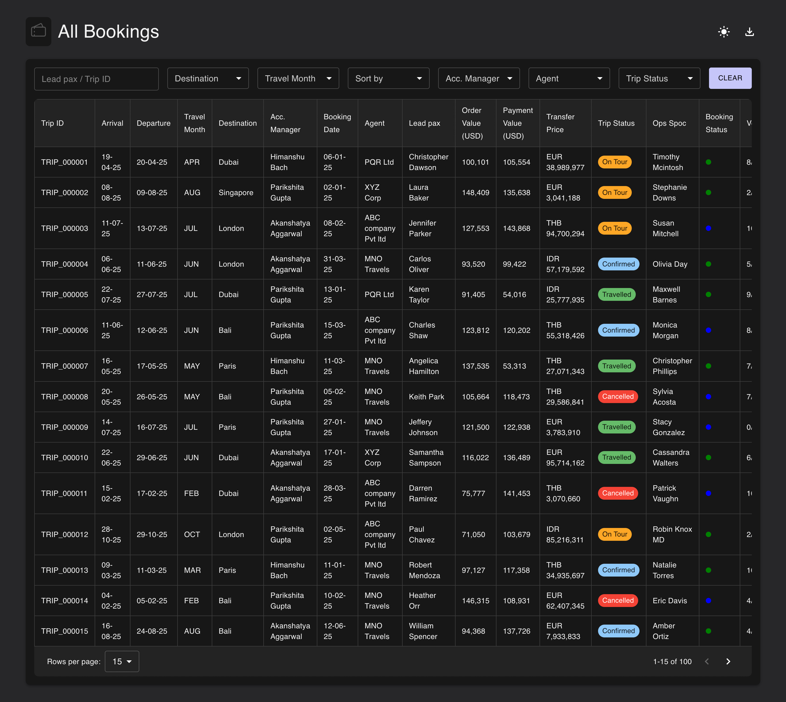

<h1 id="-himanshu_bachchan_test_design_evoque-react-mui-upwork-demo-project">🧾 Booking Dashboard (React + MUI) – Upwork Demo Project</h1>
<p align="center">
    
    
    
    
    
</p>
<p>A modern, single-page React application that demonstrates professional-level frontend development using Material UI (MUI), responsive layout, custom filtering, CSV export, and light/dark theme support.</p>
<p>This project is designed to showcase my ability to create interactive, theme-aware, and data-driven UI dashboards with a strong emphasis on user experience and code quality.</p>
<hr>
<h2 id="-preview">📸 Preview</h2>
<p></p>
<hr>
<h2 id="-tech-stack">🛠️ Tech Stack</h2>
<table>
    <thead>
        <tr>
            <th>Feature</th>
            <th>Tool / Library</th>
        </tr>
    </thead>
    <tbody>
        <tr>
            <td>Frontend Framework</td>
            <td><a href="https://reactjs.org">React 19</a> with <a href="https://vitejs.dev">Vite</a></td>
        </tr>
        <tr>
            <td>UI Component System</td>
            <td><a href="https://mui.com">MUI v7 (Material UI)</a></td>
        </tr>
        <tr>
            <td>Styling</td>
            <td>MUI System + <code>sx</code> prop</td>
        </tr>
        <tr>
            <td>Data Handling</td>
            <td>Custom JS logic with live filtering and sorting</td>
        </tr>
        <tr>
            <td>CSV Export</td>
            <td>Native Blob download</td>
        </tr>
        <tr>
            <td>Theme Switching</td>
            <td>MUI ThemeProvider with custom dark mode colors</td>
        </tr>
        <tr>
            <td>Pagination</td>
            <td>MUI Pagination with dynamic page size</td>
        </tr>
        <tr>
            <td>Assets</td>
            <td>Logo and MUI Icons</td>
        </tr>
    </tbody>
</table>
<hr>
<h2 id="-features">📦 Features</h2>
<h3 id="-responsive-modern-layout">✅ Responsive &amp; Modern Layout</h3>
<ul>
    <li>Fully responsive grid using MUI’s <code>Box</code>, <code>Flex</code>, and <code>Grid</code> system.</li>
    <li>Clean two-tone layout: card-style filters + table on a themed background.</li>
</ul>
<h3 id="-booking-table-with-filtering">✅ Booking Table with Filtering</h3>
<ul>
    <li>Real-time filtering by:
        <ul>
            <li>Lead pax / Trip ID</li>
            <li>Destination</li>
            <li>Travel Month</li>
            <li>Sort by Booking Date / Arrival / Departure</li>
            <li>Acc. Manager</li>
            <li>Agent</li>
            <li>Trip status</li>
        </ul>
    </li>
    <li>Live sorting logic using safe date parsing.</li>
</ul>
<h3 id="-csv-export">✅ CSV Export</h3>
<ul>
    <li>Exports only <strong>visible (filtered)</strong> rows to CSV.</li>
    <li>Preserves headers and proper cell quoting.</li>
    <li>Downloaded directly in-browser via native Blob.</li>
</ul>
<h3 id="-light-dark-theme-toggle">✅ Light/Dark Theme Toggle</h3>
<ul>
    <li>MUI ThemeProvider powered toggle.</li>
    <li>Custom dark mode colors:
        <ul>
            <li><code>#272729</code> body</li>
            <li><code>#171717</code> card background</li>
        </ul>
    </li>
    <li>Text and divider color adapts based on mode.</li>
</ul>
<h3 id="-styled-to-match-mockup">✅ Styled to Match Mockup</h3>
<ul>
    <li>Custom spacing, paddings, and heights.</li>
    <li>Full-width filters, pastel pill styling, compact UI.</li>
    <li>Clean cell borders using <code>theme.palette.divider</code>.</li>
</ul>
<hr>
<h2 id="-how-to-run-locally">🚀 How to Run Locally</h2>
<h3 id="prerequisites">Prerequisites</h3>
<ul>
    <li>Node.js v23+ (tested on v23.7.0)</li>
    <li>npm or yarn</li>
</ul>
<p>```bash git clone <a href="https://github.com/mkakadiya47/himanshu_bachchan_test_design_evoque.git">https://github.com/mkakadiya47/himanshu_bachchan_test_design_evoque.git</a> cd himanshu_bachchan_test_design_evoque npm install npm run dev</p>

<h2>🚀 Live Demo</h2>

<p>
  You can view the live working demo of this project here: 
  <a href="https://mkakadiya47.github.io/himanshu_bachchan_test_design_evoque/" target="_blank">
    Click here
  </a>
</p>
